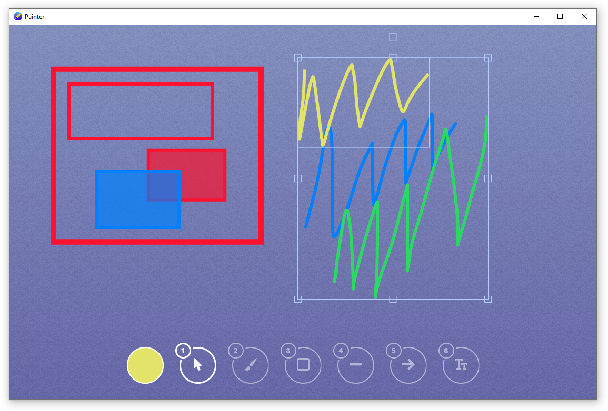

# Presentation drawing app
App for drawing over desktop made in Electron

Video from the presentation:

https://www.youtube.com/watch?v=3Hy6OED8XXE

### Installation
Install all dependency by **npm install**. Then run **npm start**.
In task bar (window) blue icon will show up.
Then you may hit F7 to start draw on screen.

### Keys
Below you can find list of default keys uses in application. You can change it in <strong>settings.json</strong> file.

### Tools:
* **1** - select
* **2** - free draw
* **3** - rectangle
* **4** - line
* **5** - arrow
* **6** - text

In select mode you can group / ungroup objects with **Ctrl + G** and **Ctrl + Shift  + G**

### Colors:
* **r** - red
* **g** - green
* **b** - blue
* **p** - pink
* **y** - yellow
* **o** - orange

### Other stuff:
* **mouse wheel up** increase size
* **mouse wheel down** decrease size
* **c** - clear screen
* **`** - toggle gui menu
* **/** - toggle white board